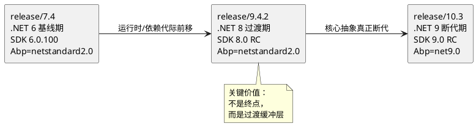
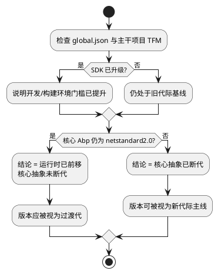
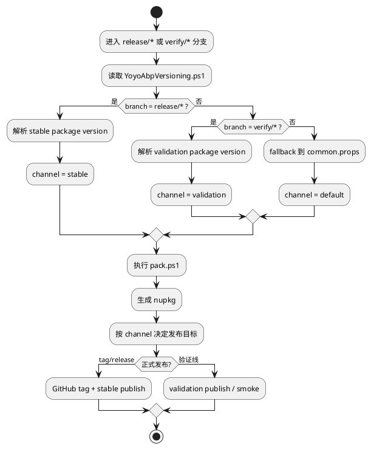
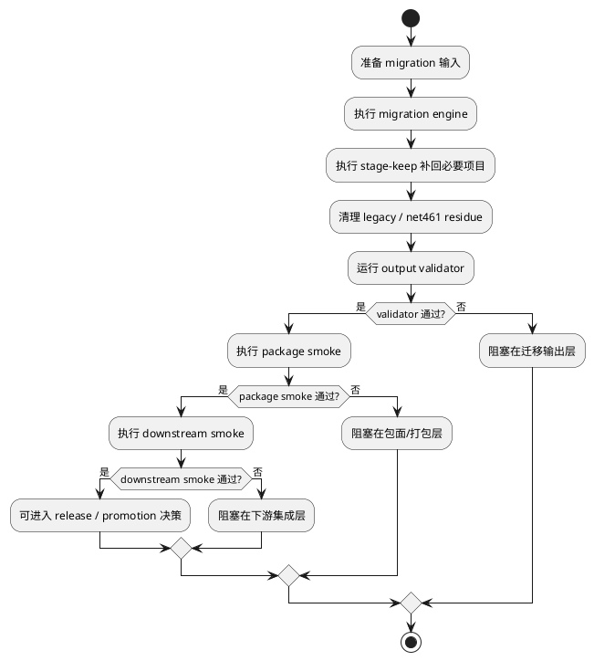

# Yoyo.Abp 三版本演进审查报告（`7.4` → `9.4.2` → `10.3`）

- 生成日期：2026-04-26
- 目标读者：技术负责人、架构评审、升级执行者
- 文档定位：内部审查主报告，不是普通 changelog
- 审查对象：`release/7.4`、`release/9.4.2`、`release/10.3`

## 快速阅读导航

- 如果你要判断**应该把哪个版本视为当前目标态**，优先看《执行摘要》《代际总览》《结论》。
- 如果你要判断**`9.4.2` 是否值得保留为独立升级台阶**，优先看《框架演进主线》《关键变化解读》《框架演进矩阵》。
- 如果你要判断**为什么这不是单纯的框架升级，而是发布治理升级**，优先看《发布治理与迁移保障》《治理能力矩阵》。
- 如果你要判断**`release/10.3` 为什么尚未形成同等级闭环**，优先看《风险、限制与升级建议》《附录证据》。

## 目标与范围

本文的目标不是简单罗列三个版本“改了什么”，而是回答以下问题：

1. 为什么 `7.4`、`9.4.2`、`10.3` 必须作为一条连续演进链来审查，而不是只看终点 `10.3`。
2. 哪些变化属于**框架本体**的代际演进，哪些变化属于**发布治理 / 迁移保障**能力的成熟。
3. 为什么 `9.4.2` 是关键过渡代，而不是可被 `10.3` 直接吞掉的中间版本。
4. 当前三条发布线的验证状态、交付成熟度和剩余阻塞分别是什么。

本文**不**做以下事情：

- 不展开 33 个包的逐项 diff；如需包级清单，应单独进入附录或后续专题。
- 不把普通构建 warning 当作版本结论。
- 不把 `release/10.3` 当前 SDK 环境阻塞误写成框架质量判断。

## 证据来源

本文中的结论以以下文件为事实源：

- `c:\Code\yoyoboot\Yoyo.Abp\.worktrees\release-7.4\global.json`
- `c:\Code\yoyoboot\Yoyo.Abp\.worktrees\release-9.4.2\global.json`
- `c:\Code\yoyoboot\Yoyo.Abp\.worktrees\release-10.3\global.json`
- `c:\Code\yoyoboot\Yoyo.Abp\.worktrees\release-7.4\src\Abp\Abp.csproj`
- `c:\Code\yoyoboot\Yoyo.Abp\.worktrees\release-9.4.2\src\Abp\Abp.csproj`
- `c:\Code\yoyoboot\Yoyo.Abp\.worktrees\release-10.3\src\Abp\Abp.csproj`
- `c:\Code\yoyoboot\Yoyo.Abp\.worktrees\release-7.4\src\Abp.ZeroCore\Abp.ZeroCore.csproj`
- `c:\Code\yoyoboot\Yoyo.Abp\.worktrees\release-9.4.2\src\Abp.ZeroCore\Abp.ZeroCore.csproj`
- `c:\Code\yoyoboot\Yoyo.Abp\.worktrees\release-10.3\src\Abp.ZeroCore\Abp.ZeroCore.csproj`
- `c:\Code\yoyoboot\Yoyo.Abp\.worktrees\release-7.4\src\Abp.EntityFrameworkCore\Abp.EntityFrameworkCore.csproj`
- `c:\Code\yoyoboot\Yoyo.Abp\.worktrees\release-9.4.2\src\Abp.EntityFrameworkCore\Abp.EntityFrameworkCore.csproj`
- `c:\Code\yoyoboot\Yoyo.Abp\.worktrees\release-10.3\src\Abp.EntityFrameworkCore\Abp.EntityFrameworkCore.csproj`
- `c:\Code\yoyoboot\Yoyo.Abp\.worktrees\release-7.4\src\Abp.ZeroCore.IdentityServer4.vNext\Abp.ZeroCore.IdentityServer4.vNext.csproj`
- `c:\Code\yoyoboot\Yoyo.Abp\.worktrees\release-9.4.2\src\Abp.ZeroCore.IdentityServer4.vNext\Abp.ZeroCore.IdentityServer4.vNext.csproj`
- `c:\Code\yoyoboot\Yoyo.Abp\.worktrees\release-10.3\src\Abp.ZeroCore.IdentityServer4.vNext\Abp.ZeroCore.IdentityServer4.vNext.csproj`
- `c:\Code\yoyoboot\Yoyo.Abp\.worktrees\release-10.3\src\Abp.ZeroCore.IdentityServer4.vNext.EntityFrameworkCore\Abp.ZeroCore.IdentityServer4.vNext.EntityFrameworkCore.csproj`
- `c:\Code\yoyoboot\Yoyo.Abp\tools\yoyo-abp-migration\YoyoAbpVersioning.ps1`
- `c:\Code\yoyoboot\Yoyo.Abp\tools\yoyo-abp-migration\Invoke-YoyoAbpMigration.ps1`
- `c:\Code\yoyoboot\Yoyo.Abp\nupkg\pack.ps1`
- `c:\Code\yoyoboot\Yoyo.Abp\nupkg\pack_push.ps1`
- `c:\Code\yoyoboot\Yoyo.Abp\docs\superpowers\reports\2026-04-26-yoyo-abp-release-version-policy.md`

## 执行摘要

- `release/7.4` 是 Yoyo.Abp 从 `7.3.x` 进入正式发布化升级路线的**.NET 6 基线期**，其 SDK 基线为 `6.0.100`，但核心 `Abp` 仍保持 `netstandard2.0` 形态。
- `release/9.4.2` 是**.NET 8 过渡期**：开发和运行时基线已经抬升到 .NET 8 代际，但核心 `Abp` 依然保持 `netstandard2.0`，因此它不能被视为“已经完成断代”的版本。
- `release/10.3` 才是真正的**.NET 9 断代期**：核心 `Abp` 与 `Abp.EntityFrameworkCore`、`Abp.ZeroCore`、`Abp.AspNetCore` 都已经进入 `net9.0`。
- `9.4.2` 的价值不在于“比 `7.4` 新”，而在于它充当了从 `.NET 6` 到 `.NET 9` 之间的**语义缓冲层**：SDK 和依赖先前移，核心抽象层在下一代再完成断代。
- 身份认证支线并未与核心抽象完全同步：在 `release/10.3` 中，`Abp.ZeroCore.IdentityServer4.vNext` 仍为 `net8.0`，但其 EF Core 适配项目已经是 `net9.0`，说明该支线带有明显的跨代兼容痕迹。
- 数据访问层呈现清晰代际推进：`Abp.EntityFrameworkCore` 从 `Microsoft.EntityFrameworkCore 6.0.10` 升到 `8.0.8`，再升到 `9.0.8`，这是版本升级中最清晰、最直接的框架证据之一。
- 发布治理方面，`YoyoAbpVersioning.ps1` 已把 `release/*`、`verify/*`、显式版本覆写和 `common.props` fallback 收敛成统一规则，说明三条发布线已不再依赖临时人工约定。
- `release/7.4` 与 `release/9.4.2` 的包元数据（logo、GitHub URL）已完成验证并提交；`release/10.3` 的同类改动已写入 worktree，但由于当前环境缺失 `global.json` 要求的 .NET 9 SDK，尚未完成同等级验证与提交。

## 审查结论速览

| 关注点 | 结论 | 解释 |
| --- | --- | --- |
| 当前最能代表未来主线的版本 | `release/10.3` | 核心 `Abp` 已进入 `net9.0`，主干模块完成断代 |
| 不能跳过的过渡版本 | `release/9.4.2` | 运行时与关键依赖已前移到 .NET 8，但核心抽象仍保留旧兼容层 |
| 最稳定的历史对照基线 | `release/7.4` | 它提供了从 `.NET 6` 正式 release 化起步的稳定起点 |
| 当前未闭环的主要原因 | 环境阻塞而非设计失效 | `release/10.3` 受 .NET 9 SDK 缺失影响，尚未完成同等级验证 |
| 适合对外裁剪成升级说明的内容 | 代际总览 + 框架演进矩阵 + 版本演进图 | 主文中的治理细节更适合作为内部审查材料保留 |

## 代际总览

| 版本 | 阶段定位 | `global.json` SDK | 核心 `Abp` TFM | 升级关键词 | 当前状态 |
| --- | --- | --- | --- | --- | --- |
| `release/7.4` | .NET 6 基线期 | `6.0.100` + `latestMinor` | `netstandard2.0` | 基线稳定、首条正式 release 线、33 包兼容面延续 | 已验证关键包元数据并提交 |
| `release/9.4.2` | .NET 8 过渡期 | `8.0.100-rc.1.23463.5` + `latestFeature` | `netstandard2.0` | SDK/依赖前移、核心抽象未断代、治理能力增强 | 已验证关键包元数据并提交 |
| `release/10.3` | .NET 9 断代期 | `9.0.100-rc.2.24474.11` + `latestFeature` | `net9.0` | 核心抽象断代、EF/ASP.NET Core/ZeroCore 同步进位、环境要求显著抬升 | 核心演进已成型，当前环境验证受 SDK 阻塞 |

## 版本演进总览图（PlantUML）

## 框架演进主线

### `release/7.4`：.NET 6 基线期

从证据上看，`release/7.4` 具有以下特征：

- `global.json` 锁定 SDK `6.0.100`，`rollForward` 为 `latestMinor`。
- 核心 `Abp` 项目（`src/Abp/Abp.csproj`）仍为 `netstandard2.0`。
- `Abp.ZeroCore` 项目（`src/Abp.ZeroCore/Abp.ZeroCore.csproj`）为 `net6.0`。
- `Abp.EntityFrameworkCore` 项目为 `net6.0`，使用 `Microsoft.EntityFrameworkCore 6.0.10`。
- `Abp.ZeroCore.IdentityServer4.vNext` 项目为 `net6.0`，`IdentityServer4` 与 `IdentityServer4.AspNetIdentity` 均为 `4.1.2`。
- `Fody` 与 `Microsoft.SourceLink.GitHub` 仍停留在 `6.6.4 / 1.1.1` 这一代组合。

这说明 `7.4` 的战略意义不是“全面现代化”，而是：

1. 把 Yoyo.Abp 从 `7.3.x` 的自家补丁线，推进到一条对外更清晰的正式 release 线；
2. 在不立刻撕裂核心抽象层的情况下，完成 `.NET 6` 基线稳定；
3. 为后续 `9.4.2` 与 `10.3` 的跨代演进保留一个可验证、可回退、可对照的起点。

### `release/9.4.2`：.NET 8 过渡期

`release/9.4.2` 是整个演进链里最容易被误解、但其实最值得保留独立章节的版本。

证据显示：

- `global.json` 已提升到 `8.0.100-rc.1.23463.5`，`rollForward=latestFeature`。
- 核心 `Abp` 仍为 `netstandard2.0`。
- `Abp.ZeroCore` 已是 `net8.0`。
- `Abp.EntityFrameworkCore` 已是 `net8.0`，EF Core 升为 `8.0.8`。
- 核心 `Abp` 中引入了 `System.Text.Json 8.0.4`，同时保留 `Newtonsoft.Json 13.0.3`。
- `Microsoft.Extensions.Caching.Memory`、`Microsoft.Extensions.Options` 等基础依赖已抬升到 `8.x`。
- `Abp.ZeroCore.IdentityServer4.vNext` 已是 `net8.0`，但仍依赖 `IdentityServer4 4.1.2`。
- `Microsoft.SourceLink.GitHub` 已升为 `8.0.0`，`Fody` 升为 `6.8.1`。

因此，`9.4.2` 的核心定位应当是：

- 运行时基线和大多数关键依赖已经进入 `.NET 8` 代际；
- 但核心 `Abp` 还没有完成从 `netstandard2.0` 到具体现代 TFM 的断代；
- 它的价值在于把“运行时升级”和“核心抽象断代”拆成两个阶段完成，而不是一次性完成所有风险动作。

### `release/10.3`：.NET 9 断代期

`release/10.3` 是目前三条线中最接近“新代际终态”的版本。

证据显示：

- `global.json` 锁定 SDK `9.0.100-rc.2.24474.11`，`rollForward=latestFeature`。
- 核心 `Abp` 项目已从 `netstandard2.0` 切换到 `net9.0`。
- `Abp.ZeroCore` 为 `net9.0`。
- `Abp.EntityFrameworkCore` 为 `net9.0`，EF Core 升为 `9.0.8`。
- `Abp.AspNetCore` 为 `net9.0`，并使用 `Microsoft.AspNetCore.Mvc.NewtonsoftJson 9.0.8` 与 `Razor.RuntimeCompilation 9.0.8`。
- 核心 `Abp` 中启用了 `EnableUnsafeBinaryFormatterSerialization=true`，说明在进入 .NET 9 后，还需要显式承担一定的兼容性包袱。
- 但身份认证支线并非完全齐步：`Abp.ZeroCore.IdentityServer4.vNext` 仍为 `net8.0`，其 EF Core 集成项目 `Abp.ZeroCore.IdentityServer4.vNext.EntityFrameworkCore` 已为 `net9.0`。

因此，`10.3` 不能只被描述成“升级到了 .NET 9”，更准确的说法应当是：

- 核心抽象与主干模块已经完成断代；
- 但特定认证支线仍带有跨代兼容特征；
- 它已经是当前最有代表性的目标态，但其验证门槛也因此显著抬高。

## 关键变化解读

### 运行时与 SDK

三代的 `global.json` 与主干项目 TFM 共同揭示了一个重要事实：

- `7.4`：SDK 与主干能力共同停留在 `.NET 6` 基线。
- `9.4.2`：SDK 和大多数模块先抬升到 `.NET 8`，但核心 `Abp` 仍保持 `netstandard2.0`。
- `10.3`：核心 `Abp` 与主干模块才真正进入 `.NET 9`。

这说明版本演进不是一次性跃迁，而是一个“先推进运行时，再推进核心抽象层”的两阶段策略。

### 核心抽象层

核心 `Abp` 是判断“是否真正断代”的最关键文件。

- `7.4` / `9.4.2`：`src/Abp/Abp.csproj` 都是 `netstandard2.0`
- `10.3`：`src/Abp/Abp.csproj` 变为 `net9.0`

这意味着：

- `9.4.2` 虽然新，但仍可被看作旧抽象层与新运行时之间的桥梁；
- `10.3` 才是需要对下游进行真正“断代审查”的版本。

### 数据访问 / EF Core

`Abp.EntityFrameworkCore` 给出了最清晰的代际证据：

- `7.4`：`net6.0` + `Microsoft.EntityFrameworkCore 6.0.10`
- `9.4.2`：`net8.0` + `Microsoft.EntityFrameworkCore 8.0.8`
- `10.3`：`net9.0` + `Microsoft.EntityFrameworkCore 9.0.8`

这条线的变化非常适合进入矩阵，因为它几乎是三代升级最线性的技术事实。

### 认证与 ZeroCore

`ZeroCore` 与 `IdentityServer4.vNext` 呈现出更复杂的节奏：

- `Abp.ZeroCore` 本体是 `net6.0 -> net8.0 -> net9.0`
- `Abp.ZeroCore.IdentityServer4.vNext` 是 `net6.0 -> net8.0 -> net8.0`
- `Abp.ZeroCore.IdentityServer4.vNext.EntityFrameworkCore` 在 `10.3` 已进入 `net9.0`

这说明 `10.3` 的认证支线存在“主线前进、子线跨代兼容”的痕迹，因此这部分不应只写成“同步升级完成”。

### 序列化与基础设施

核心 `Abp` 的依赖升级也揭示了平台演进节奏：

- `Newtonsoft.Json`：`13.0.1 -> 13.0.3 -> 13.0.3`
- `System.Text.Json`：`7.4` 尚未引入，`9.4.2` 为 `8.0.4`，`10.3` 为 `9.0.8`
- `Microsoft.SourceLink.GitHub`：`1.1.1 -> 8.0.0 -> 8.0.0`
- `Fody`：`6.6.4 -> 6.8.1 -> 10.3` 中核心 `Abp` 已不再内联更新节点，但其他项目仍使用更新代际

这体现的是：`9.4.2` 已经把构建和运行时基础设施整体前推，而 `10.3` 则把核心项目也同步带进新代际。

### 测试与样例

测试与样例最适合在主文里以“状态”而不是细目呈现：

- `7.4` 对应的是 .NET 6 基线验证体系
- `9.4.2` 已进入 .NET 8 测试代际，并配合 upgrade radar / smoke 工具形成治理闭环
- `10.3` 的文档和代码基线已经反映 .NET 9 方向，但当前环境验证仍受 SDK 阻塞

## 框架断代判断图（PlantUML）

## 框架演进矩阵

| 版本 | 阶段定位 | SDK / `global.json` | 核心 `Abp` TFM | 核心依赖代际 | 数据访问层 | 认证 / ZeroCore | 核心模块面 | 测试与样例 | 升级关键词 |
| --- | --- | --- | --- | --- | --- | --- | --- | --- | --- |
| `release/7.4` | 基线期 | `6.0.100` + `latestMinor` | `netstandard2.0` | `Newtonsoft.Json 13.0.1`、SourceLink `1.1.1` | EF Core `6.0.10`，`Abp.EntityFrameworkCore=net6.0` | `ZeroCore=net6.0`，`IdentityServer4.vNext=net6.0`，IS4=`4.1.2` | 主干模块维持 33 包兼容线 | 基于 `.NET 6` 的稳定基线 | 基线、稳定、首条正式发布线 |
| `release/9.4.2` | 过渡期 | `8.0.100-rc.1.23463.5` + `latestFeature` | `netstandard2.0` | 引入 `System.Text.Json 8.0.4`，保留 `Newtonsoft.Json 13.0.3`，SourceLink `8.0.0` | EF Core `8.0.8`，`Abp.EntityFrameworkCore=net8.0` | `ZeroCore=net8.0`，`IdentityServer4.vNext=net8.0`，IS4 仍为 `4.1.2` | 运行时整体前移，核心抽象未断代 | .NET 8 代际测试与治理工具成形 | 过渡、缓冲、依赖前移 |
| `release/10.3` | 断代期 | `9.0.100-rc.2.24474.11` + `latestFeature` | `net9.0` | `System.Text.Json 9.0.8`、`Microsoft.Extensions.* 9.x`、BinaryFormatter 兼容开关 | EF Core `9.0.8`，`Abp.EntityFrameworkCore=net9.0` | `ZeroCore=net9.0`，但 `IdentityServer4.vNext=net8.0`，其 EF Core 集成项目为 `net9.0` | 核心主干进入 .NET 9，认证支线仍带跨代痕迹 | 当前环境下验证受 SDK 缺口影响 | 断代、主干进位、环境门槛抬升 |

## 发布治理与迁移保障

如果只看框架项目文件，读者只能知道“版本在变”；而要解释“为什么这些版本能成为正式发布线”，还必须把治理链路单列出来。

治理侧目前最关键的事实包括：

- `tools/yoyo-abp-migration/YoyoAbpVersioning.ps1` 已集中定义 package version / channel 的解析规则。
- `release/*` 走 stable channel，`verify/*` 走 validation channel。
- `nupkg/pack.ps1` 与 `nupkg/pack_push.ps1` 已成为打包与推包的统一入口。
- `Invoke-YoyoAbpMigration.ps1`、stage-keep、residue cleanup、validator、smoke 构成了迁移保障主链路。
- 包元数据（`PackageIcon`、`PackageProjectUrl`、`RepositoryUrl`）已在当前主线、`release/7.4`、`release/9.4.2` 收敛到 `https://github.com/yoyoboot/Yoyo.Abp` 与 `logo_600.png`。

这部分不是框架演进本体，但它决定了这些版本能否真正稳定落地、能否被下游可信消费。

## 发布治理流程图（PlantUML）

## 治理能力矩阵

| 版本 | 版本解析策略 | 发布目标与渠道 | 包元数据治理 | 迁移引擎能力 | 兼容残留清理 | 输出校验 | 验证覆盖 | 当前状态 | 备注 |
| --- | --- | --- | --- | --- | --- | --- | --- | --- | --- |
| `release/7.4` | `release/7.4 -> 7.4.0` | stable | 已收敛到 `logo_600.png` 与 `yoyoboot/Yoyo.Abp` | 已纳入统一 migration 语境 | 已有 residue/legacy 清理经验 | package surface / validator 已用于这条线 | 包元数据验证通过 | 已提交 | HEAD=`b252e5e4338414a143cf954c2815af8ff6861a4d` |
| `release/9.4.2` | `release/9.4.2 -> 9.4.2` | stable | 已收敛到 `logo_600.png` 与 `yoyoboot/Yoyo.Abp` | 升级雷达、治理文档更成熟 | `net461` / legacy residue 清理经验增强 | validator、upgrade radar、治理基线更清晰 | 包元数据验证通过 | 已提交 | HEAD=`0c86bafeb00da84f437c42c372404d9b41e771f4` |
| `release/10.3` | `release/10.3 -> 10.3.0` | stable（目标态） | worktree 已调整，但未完成同等级提交 | 迁移治理能力可沿用 | 逻辑上已具备，但受环境阻塞未完整复证 | 规则存在，验证证据尚未对齐到已提交状态 | 当前环境下 pack 级验证受 SDK 限制 | 未完成同等级提交 | HEAD=`0c23ea7e147eb49ff3c1c74c46f19b7306bbd6dc`，存在未提交变更 |

## 迁移保障门禁图（PlantUML）

## 风险、限制与升级建议

### 框架层面的风险

1. **不要把 SDK 升级误当作核心抽象断代完成**  
   `9.4.2` 已明确说明：SDK 和主干模块先进入 `.NET 8`，但核心 `Abp` 仍为 `netstandard2.0`。

2. **不要把 `10.3` 简化成“全部都到了 net9.0”**  
   认证支线中的 `Abp.ZeroCore.IdentityServer4.vNext` 仍为 `net8.0`，说明断代并不是所有模块完全同步完成。

3. **不要忽略兼容性开关的信号**  
   `release/10.3` 的 `Abp.csproj` 中启用了 `EnableUnsafeBinaryFormatterSerialization`，这说明在进入 .NET 9 后，兼容性处理仍然是显性问题，不应假设“升级后自然纯净”。

### 环境 / 治理层面的限制

1. **`release/10.3` 当前验证受 SDK 环境阻塞**  
   `global.json` 需要 `9.0.100-rc.2.24474.11`，当前环境未满足这一前提，因此其包元数据相关改动尚未完成与 `7.4` / `9.4.2` 同等级的验证和提交。

2. **治理能力成熟度不等于所有分支都已闭环**  
   版本规则、迁移规则、验证脚本已经形成治理框架，但 `10.3` 仍需要对应环境到位后，才能完成同等级验证闭环。

3. **不要把包元数据收口混入框架升级判断**  
   logo、ProjectUrl、RepositoryUrl 的统一非常重要，但它应归类到治理成熟度，而不是框架能力本体。

### 升级建议

- 对面向未来的目标态判断，应以 `release/10.3` 为主。
- 对风险可控、路径可解释、下游可承接的升级设计，应把 `release/9.4.2` 视为必要中间层。
- 若要形成对外升级说明，推荐从本报告中裁剪：保留代际总览、框架演进矩阵和版本演进图，把治理细节降级为附录或内部文档。

## 附录证据

### 分支状态与提交事实

| 分支 | 版本目标 | 当前 HEAD | 状态摘要 |
| --- | --- | --- | --- |
| `release/7.4` | `7.4.0` | `b252e5e4338414a143cf954c2815af8ff6861a4d` | 包元数据收口已验证并提交 |
| `release/9.4.2` | `9.4.2` | `0c86bafeb00da84f437c42c372404d9b41e771f4` | 包元数据收口已验证并提交 |
| `release/10.3` | `10.3.0` | `0c23ea7e147eb49ff3c1c74c46f19b7306bbd6dc` | `common.props`、`nupkg/logo_600.png`、`RunPackaging-metadata-uses-logo600.ps1` 仍为未提交变更 |

### 当前 `release/10.3` 未提交变更

根据当前 worktree 状态，`release/10.3` 仍有以下未提交项：

- `common.props`
- `nupkg/logo_600.png`
- `tools/yoyo-abp-migration/tests/RunPackaging-metadata-uses-logo600.ps1`

这些变更不是逻辑上不可接受，而是由于当前环境无法提供 `global.json` 所要求的 .NET 9 SDK，导致尚未完成与 `7.4` / `9.4.2` 同等级的验证与提交闭环。

### 关键文件索引

- 版本解析规则：`tools/yoyo-abp-migration/YoyoAbpVersioning.ps1`
- 打包入口：`nupkg/pack.ps1`
- 推包入口：`nupkg/pack_push.ps1`
- 迁移治理入口：`tools/yoyo-abp-migration/Invoke-YoyoAbpMigration.ps1`
- 发布 / 版本 / 渠道策略：`docs/superpowers/reports/2026-04-26-yoyo-abp-release-version-policy.md`
- `v9.4.2` 升级雷达：`docs/superpowers/reports/2026-04-26-yoyo-abp-v9.4.2-upgrade-radar.md`
- `v10.x` 前置门禁：`docs/superpowers/reports/2026-04-26-yoyo-abp-v10x-pre-gates.md`

## 结论

如果只从“今天能不能直接用 `10.3`”来判断，那么这三条发布线的价值会被严重低估。真正合理的审查结论应当是：

- `7.4` 是稳定基线；
- `9.4.2` 是必要的过渡缓冲层；
- `10.3` 是核心断代后的目标态；
- 而把三者真正串起来、变成可发布可验证系统的，是版本解析、迁移门禁、包面校验和下游 smoke 所构成的治理能力。

因此，`7.4 -> 9.4.2 -> 10.3` 不应被看作三个孤立版本，而应被看作一条**从基线稳定、到运行时前移、再到核心抽象断代**的连续演进链。